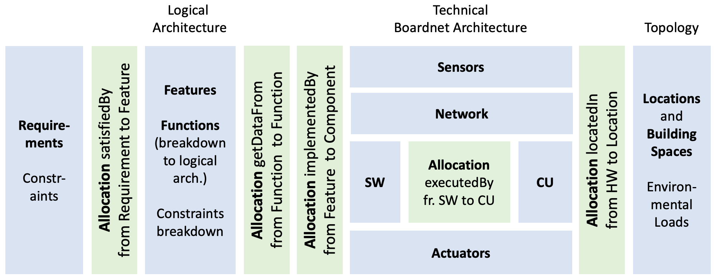

# Contents 
[toc]
# Overview
OpenBoardnet is a SysML v2 Library for Analysis of BoardNet Architectures.
Based on the Automotive Architecture Framework (AAF), it employs SysML v2 to define and interconnect elements such as requirements, features, functions, and hardware components.

It is written in SysMD/SysML v2 textual and permits the analysis (consistency checking, computation of parameters) of boardnet architectures by constraint propagation.
This framework facilitates the modeling of logical and technical architectures, data flow, and physical topology within vehicles. 
By integrating attributes, constraints, and allocation relationships, OpenBoardnet enables detailed system analyses, supports ISO26262 compliance, 
and provides tools for environmental load estimation and mission profile derivation.


It has been created by RPTU with support from the BMBF within the projects:
- *Arrowhead tools* (SysML v2 standardization)
- *GENIAL!* (Implementation tools & Conception)
- *KI4BoardNet* (Model Libraries & improved AI support)
## Objective and overall approach
Objective of the model suite *OpenBoardnet* is to support the analysis of different boardnet architectures and topologies, in particular domain- and zonal architectures and topologies. 
For this purpose, we model general knowledge in a parameterized form.

The open boardnet model allows users to model the allocation of functions or features to processors that are located in a 3-dimensional car topology.
# Core Architecture and Data Foundations
## System
System defines the overall OpenBoardnet system architecture, specifying the high-level system components, their interfaces, and the structural organization. It provides the foundational blueprint for how system elements like hardware, software, functions, and features relate and integrate to fulfill system requirements.
## BaseTypes
[BaseTypes](BaseTypes.md) contains concrete instance definitions of the OpenBoardnet system elements, including specific hardware devices, software modules, functions, features, and locations. It represents a particular configuration or deployment of the OpenBoardnet model, populating the system architecture with real elements and their relationships.
## Logical Architecture
[LogicalArchitecture](LogicalArchitecture.md) defines the abstract functional organization of the vehicle system. It structures features and functions into logical units, such as Domains or Zones, independent of the specific hardware implementation.
## Technical Architecture
[TechnicalArchitecture](TechnicalArchitecture.md) describes the concrete physical realization of the system architecture. It specifies the deployment of hardware components (ECUs, Sensors, Actuators) and defines the physical networking and wiring topology required to connect them.
## Allocations
[Allocations](Allocations.md) serves as the central integration layer that bridges the Logical and Technical architectures. It ensures that behaviors, resources, and constraints are properly assigned by mapping logical features to technical hardware (e.g., *satisfiedBy*, *executedBy*, *locatedIn*) and verifying that system requirements are satisfied by the combined architecture.
# Component Classes & Packages

The following sections give an overview of OpenBoardnet packages that each model different aspects.
## Requirements
[Requirements](Requirements.md) define mandatory system requirements as the starting point of the development process. They specify functional and non-functional conditions that must be fulfilled by features and functions.
## Features and Functions
[FeaturesFunctions](FeaturesFunctions.md) translate requirements into specific system capabilities (features) and operationalize these through executable functional building blocks. They form the logical architecture layer between requirements and technical implementation.

The package consists of a comprehensive set of possible functions and requirements that can be mapped to compute units. Each feature is roughly characterized by abstract parameters like:
- Processing load (IPC)
- I/O load (Data from source) with latency constraints (Max. delay) and expected bus load
- Required other features
## Sensors
[Sensors](Sensors.md) capture physical quantities (e.g. speed, temperature) as input data for control systems. Examples include radar sensors or cameras, which are linked to software components like SpeedMeasureSW. The package provides a set of data sources across the vehicle and beyond.
## Network
[Network](Network.md) models physical connection components like Ethernet cables with attribute-based properties (data rate, length). Enables latency calculations using MAC protocol models. 
The package provides a set of buses resp. wires that connect sensors and controllers resp. controllers and controllers.
## Software
[Software](Software.md) implements logical functions on compute units. Through allocation relationships (*executedBy*), it is assigned to specific hardware components (e.g., AbsSoftware on CentralECU).
## Compute Unit (CU) / Controllers
[CU](CU.md) (formerly "controllers") models the abstract implementations of features by a processor or compute unit. These include domain-specific controllers, zonal controllers and central high-performance computers.

In a concrete usage, this is modeled by a mapping of all features to (different) compute units. Each compute unit implements a number of features for which it needs appropriate performance. Performance is roughly characterized by abstract parameters like:
- Clock FrequencyValue (cycles per second)
- IPC (instructions per cycle)
- Input- and output data streams (bytes/second)
- Throughput and TaskSize
## Actuators
[Actuators](Actuators.md) convert control commands into physical actions (e.g., braking, steering). They operate in conjunction with assigned ECUs and implemented software components.
## Locations and Building Spaces
[LocationsAndSpaces](LocationsAndSpaces.md) define 3D coordinates for hardware components and divide the vehicle into functional areas (engine compartment, trunk). They allow for environment-related load analyses and thermal profile calculations.
## Topology
[Topology](Topology.md) introduces:
- A 3-dimensional model of the vehicle in which the components are located and connected.
- Models of the installation spaces in which wires and other components are used; they define the environmental loads.

It defines the connectivity graph of the vehicle architecture and calculates routing metrics based on coordinate distances.
## Safety & Reliability
- [Safety](Safety.md): Introduces connectors from components to safety and safety classification of features (ASIL). Defines core concepts for functional safety (ISO 26262).
- [Reliability](Reliability.md): Introduces reliability metrics. Establishes the model for system reliability (MTBF, MTTR, Failure Rates).
# SysML Package Definition

The OpenBoardnet library is in the package `OpenBoardnet`.
```SysML
package OpenBoardnet {
  private import ScalarValues::*;  // OMG Std. Datatypes
  private import ISQ::*;            // SI Units 
  private import Ranges::*;
  private import Quantities::*;
}
```
