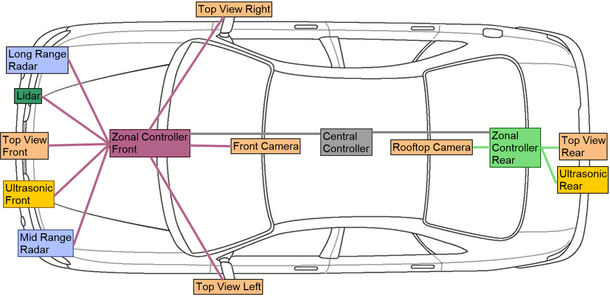
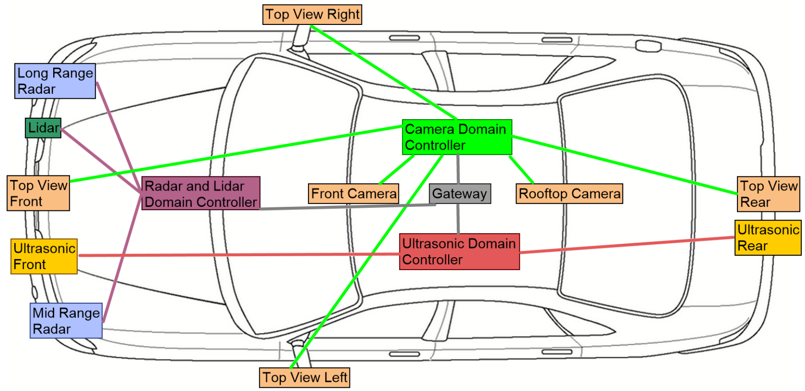

# Contents
[toc]

Describes the concrete physical realization of the system architecture. It specifies the deployment of hardware components (ECUs, Sensors, Actuators) and defines the physical networking and wiring topology required to connect them.
```SysML::OpenBoardnet::TechnicalArchitecture
private import CU::*;
private import Sensors::*;
private import Actuators::*;
private import Hardware::*;
private import Network::*;           
private import LocationsAndSpaces::*;

part def BaseArchitectureRealization {
    // Primary Vehicle Locations 
    part loc_FL : LocationsAndSpaces::wheelFrontLeft;
    part loc_FR : LocationsAndSpaces::wheelFrontRight;
    part loc_Center : LocationsAndSpaces::vehicleCenter;
    part loc_Rear : LocationsAndSpaces::rearAxle;
        
    // Analysis 
    attribute totalLength: LengthValue = bySpecializations(totalLength) {:>> range = 0..1000 [m];} 
    attribute totalWeight: MassValue = bySpecializations(totalWeight);// {:>> range = 0..1000 [g];}
    attribute totalCosts:  AmountOfMoneyValue = bySpecializations(totalCosts) {:>> range = 0..20 [EUR];} 
}
```
# Zonal Architecture

A sample definition of a zonal architecture. Note that the sensors are the same for both architectures, 
however, the architectures have different wires and controller placements. The vehicle is divided into 
physical zones (Front, Rear) with local aggregation of sensor data.
{width=800 height=300}
```SysML::OpenBoardnet::TechnicalArchitecture
part def ZonalArchitectureRealization :> BaseArchitectureRealization {
    attribute :>> totalLength = sumOverParts(pathLength); 
    attribute :>> totalWeight = sumOverParts(wireType::specificWeight * pathLength);
    attribute :>> totalCosts = sumOverParts(wireType::costsPerMeter * pathLength);
    
    part wireFrontCamera : Wire {
        part source :> Sensors::frontCamera;
        part target :> CU::zonalControllerFront;
        part sourceLocation :> LocationsAndSpaces::frontCameraLoc;
        part targetLocation :> LocationsAndSpaces::zonalControllerFrontLoc;
        part wireType : Network::Eth1000BaseT1;
    }
    part wireTopViewFront : Wire {
        part source :> Sensors::topViewFront;
        part target :> CU::zonalControllerFront;
        part sourceLocation :> LocationsAndSpaces::topViewFrontLoc;
        part targetLocation :> LocationsAndSpaces::zonalControllerFrontLoc;
        part wireType : Network::LVDS;
    }
    part wireTopViewLeft : Wire {
        part source :> Sensors::topViewLeft;
        part target :> CU::zonalControllerFront;
        part sourceLocation :> LocationsAndSpaces::topViewLeftLoc;
        part targetLocation :> LocationsAndSpaces::zonalControllerFrontLoc;
        part wireType : Network::LVDS;
    }
    part wireTopViewRight : Wire {
        part source :> Sensors::topViewRight;
        part target :> CU::zonalControllerFront;
        part sourceLocation :> LocationsAndSpaces::topViewRightLoc;
        part targetLocation :> LocationsAndSpaces::zonalControllerFrontLoc;
        part wireType : Network::LVDS;
    }
    part wireRoofCamera : Wire {
        part source :> Sensors::roofCamera;
        part target :> CU::zonalControllerFront;
        part sourceLocation :> LocationsAndSpaces::roofCameraLoc;
        part targetLocation :> LocationsAndSpaces::zonalControllerFrontLoc;
        part wireType : Network::Eth1000BaseT1;
    }
    part wireLongRangeRadar : Wire {
        part source :> Sensors::longRangeRadar;
        part target :> CU::zonalControllerFront;
        part sourceLocation :> LocationsAndSpaces::longRangeRadarLoc;
        part targetLocation :> LocationsAndSpaces::zonalControllerFrontLoc;
        part wireType : Network::CANFD;
    }
    part wireMidRangeRadar : Wire {
        part source :> Sensors::midRangeRadar;
        part target :> CU::zonalControllerFront;
        part sourceLocation :> LocationsAndSpaces::midRangeRadarLoc;
        part targetLocation :> LocationsAndSpaces::zonalControllerFrontLoc;
        part wireType : Network::CANFD;
    }
    part wireLidar : Wire [0..1] {
        part source :> Sensors::lidar;
        part target :> CU::zonalControllerFront;
        part sourceLocation :> LocationsAndSpaces::lidarLoc;
        part targetLocation :> LocationsAndSpaces::zonalControllerFrontLoc;
        part wireType : Network::Eth100BaseT1;
    }
    part wireUltrasonicFront : Wire {
        part source :> Sensors::ultrasonicsensorFront;
        part target :> CU::zonalControllerFront;
        part sourceLocation :> LocationsAndSpaces::ultrasonicsensorFrontLoc;
        part targetLocation :> LocationsAndSpaces::zonalControllerFrontLoc;
        part wireType : Network::LIN;
    }
    part wireTopViewRear : Wire {
        part source :> Sensors::topViewRear;
        part target :> CU::zonalControllerRear;
        part sourceLocation :> LocationsAndSpaces::topViewRearLoc;
        part targetLocation :> LocationsAndSpaces::zonalControllerRearLoc;
        part wireType : Network::LVDS;
    }
    part wireUltrasonicRear : Wire {
        part source :> Sensors::ultrasonicsensorRear;
        part target :> CU::zonalControllerRear;
        part sourceLocation :> LocationsAndSpaces::ultrasonicsensorRearLoc;
        part targetLocation :> LocationsAndSpaces::zonalControllerRearLoc;
        part wireType : Network::LIN;
    }
    part wireBackboneFront : Wire {
        part source: CU::zonalControllerFront;
        part target :> CU::centralController;
        part sourceLocation :> LocationsAndSpaces::zonalControllerFrontLoc;
        part targetLocation :> LocationsAndSpaces::centralControllerLoc;
        part wireType : Network::Eth1000BaseT1;
    }
    part wireBackboneRear : Wire {
        part source: CU::zonalControllerRear;
        part target :> CU::centralController;
        part sourceLocation :> LocationsAndSpaces::zonalControllerRearLoc;
        part targetLocation :> LocationsAndSpaces::centralControllerLoc;
        part wireType : Network::Eth1000BaseT1;
    }
}
```
# Domain Architecture

A sample definition of a domain architecture. Sensors are wired directly to their respective Domain Controllers
 (e.g., all Cameras to the Camera Controller). Note that we model the locations in a 3D topology; the figure below 
shows only a 2D projection.
{width=800 height=300}
```SysML::OpenBoardnet::TechnicalArchitecture
part def DomainArchitectureRealization :> BaseArchitectureRealization {
    attribute :>> totalLength = sumOverParts(pathLength);
    attribute :>> totalWeight = sumOverParts(wireType::specificWeight * pathLength);
    attribute :>> totalCosts = sumOverParts(wireType::costsPerMeter * pathLength);
    
    part wireFrontCameraDomain : Wire {
        part source :> Sensors::frontCamera;
        part target :> CU::cameraController;
        part sourceLocation :> LocationsAndSpaces::frontCameraLoc;
        part targetLocation :> LocationsAndSpaces::cameraControllerLoc;
        part wireType : Network::Eth1000BaseT1;
    }
    part wireTopViewFrontDomain : Wire {
        part source :> Sensors::topViewFront;
        part target :> CU::cameraController;
        part sourceLocation :> LocationsAndSpaces::topViewFrontLoc;
        part targetLocation :> LocationsAndSpaces::cameraControllerLoc;
        part wireType : Network::LVDS;
    }
    part wireTopViewLeftDomain : Wire {
        part source :> Sensors::topViewLeft;
        part target :> CU::cameraController;
        part sourceLocation :> LocationsAndSpaces::topViewLeftLoc;
        part targetLocation :> LocationsAndSpaces::cameraControllerLoc;
        part wireType : Network::LVDS;
    }
    part wireTopViewRightDomain : Wire {
        part source :> Sensors::topViewRight;
        part target :> CU::cameraController;
        part sourceLocation :> LocationsAndSpaces::topViewRightLoc;
        part targetLocation :> LocationsAndSpaces::cameraControllerLoc;
        part wireType : Network::LVDS;
    }
    part wireTopViewRearDomain : Wire {
        part source :> Sensors::topViewRear;
        part target :> CU::cameraController;
        part sourceLocation :> LocationsAndSpaces::topViewRearLoc;
        part targetLocation :> LocationsAndSpaces::cameraControllerLoc;
        part wireType : Network::LVDS;
    }
    part wireRoofCameraDomain : Wire {
        part source :> Sensors::roofCamera;
        part target :> CU::cameraController;
        part sourceLocation :> LocationsAndSpaces::roofCameraLoc;
        part targetLocation :> LocationsAndSpaces::cameraControllerLoc;
        part wireType : Network::Eth1000BaseT1;
    }
    part wireLongRangeRadarDomain : Wire {
        part source :> Sensors::longRangeRadar;
        part target :> CU::radarAndLidarController;
        part sourceLocation :> LocationsAndSpaces::longRangeRadarLoc;
        part targetLocation :> LocationsAndSpaces::radarAndLidarControllerLoc;
        part wireType : Network::CANFD;
    }
    part wireMidRangeRadarDomain : Wire {
        part source :> Sensors::midRangeRadar;
        part target :> CU::radarAndLidarController;
        part sourceLocation :> LocationsAndSpaces::midRangeRadarLoc;
        part targetLocation :> LocationsAndSpaces::radarAndLidarControllerLoc;
        part wireType : Network::CANFD;
    }
    part wireLidarDomain : Wire {
        part source :> Sensors::lidar;
        part target :> CU::radarAndLidarController;
        part sourceLocation :> LocationsAndSpaces::lidarLoc;
        part targetLocation :> LocationsAndSpaces::radarAndLidarControllerLoc;
        part wireType : Network::Eth100BaseT1;
    }
    part wireUltrasonicFrontDomain : Wire {
        part source :> Sensors::ultrasonicsensorFront;
        part target :> CU::ultrasonicController;
        part sourceLocation :> LocationsAndSpaces::ultrasonicsensorFrontLoc;
        part targetLocation :> LocationsAndSpaces::ultrasonicControllerLoc;
        part wireType : Network::LIN;
    }
    part wireUltrasonicRearDomain : Wire {
        part source :> Sensors::ultrasonicsensorRear;
        part target :> CU::ultrasonicController;
        part sourceLocation :> LocationsAndSpaces::ultrasonicsensorRearLoc;
        part targetLocation :> LocationsAndSpaces::ultrasonicControllerLoc;
        part wireType : Network::LIN;
    }
    part wireCameraToGateway : Wire {
        part source: CU::cameraController;
        part target :> CU::gateway;
        part sourceLocation :> LocationsAndSpaces::cameraControllerLoc;
        part targetLocation :> LocationsAndSpaces::gatewayLoc;
        part wireType : Network::Eth1000BaseT1;
    }
    part wireRadarLidarToGateway : Wire {
        part source: CU::radarAndLidarController;
        part target :> CU::gateway;
        part sourceLocation :> LocationsAndSpaces::radarAndLidarControllerLoc;
        part targetLocation :> LocationsAndSpaces::gatewayLoc;
        part wireType : Network::Eth1000BaseT1;
    }
    part wireUltrasonicToGateway : Wire {
        part source: CU::ultrasonicController;
        part target :> CU::gateway;
        part sourceLocation :> LocationsAndSpaces::ultrasonicControllerLoc;
        part targetLocation :> LocationsAndSpaces::gatewayLoc;
        part wireType : Network::Eth1000BaseT1;
    }
}
```
