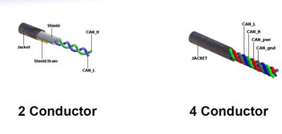
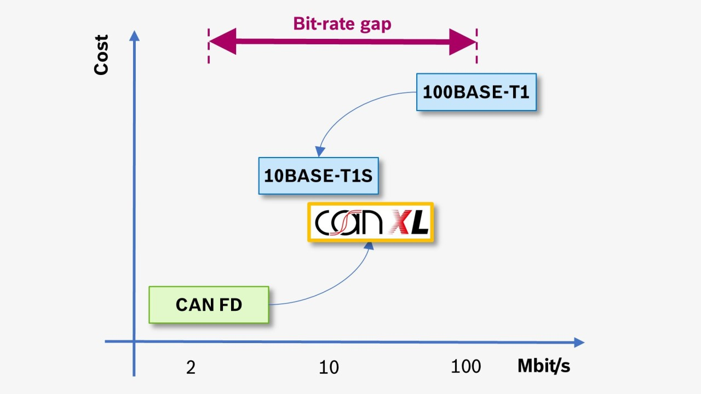

# Contents
[toc]
# Use case and modeled artefacts
The library ```network``` models the physical (PHY) and MAC layer properties of
wires and buses as relevant for the architecture exploration of in-vehicle board nets.

In the "OpenBoardnet" hierarchy, the models are located in:
- package OpenBoardnet, which holds all libraries
    - the package wires which models wires and buses

It models the following properties for typical kind of wires resp. buses
- specific wire costs per meter
- the data rate of the wire in bits
- the number of bits per frame
- the overhead per frame in bits (MAC)
- additional overhead per frame including DurationValue for beacon at PHY layer

The net data rate depends on
- the chosen parameters (packet sizes, other parameters) and the chosen wires (PHY layer).
- the collisions
# Overview of wire types

We model the following buses and wires:
- Wire, an abstract base class of all buses
- LVDS
- Ethernet
- FlexRay
- CANFD
- LIN
```SysML::OpenBoardnet
package Network {
    private import Hardware::*;
    // Base class for all wires
    part def WireType {
        attribute specificWeight: ScalarQuantityValue {:>> unit ="g/m"; :>> range="1..100";}
        attribute costsPerMeter: ScalarQuantityValue {:>> unit ="€/m"; :>> range="0.0..1.0";}
        attribute transmissionRate: BitRateValue {:>> unit ="MB/s"; :>> range="0.001 .. 10000.0";}
        attribute dataPerFrame: StorageCapacityValue {:>> unit ="B"; :>> range="0..10000";}
        attribute overheadPerFrame: StorageCapacityValue {:>> unit ="B"; :>> range="0..1000";}
        attribute arbitration: String; // deterministic (e.g. DurationValue triggered) or stochastic (e.g. old Ethernet) 
    }
    // We feature the package below with classes
}
```
## Automotive Ethernet

We assume the ethernet protocol II which is common for the automotive domain.
It has

- 46 .. 1500 Bits of data per frame (42 with VLAN Tag)
- an overhead of additional 30 Bits per frame
- A maximum payload of up to 1500 in automotive applications

We use the following source:
[Vector](https://elearning.vector.com/mod/page/view.php?id=122#section-4)
```SysML::OpenBoardnet::Network
    part def Ethernet :> WireType {
        attribute specificWeight: ScalarQuantityValue {:>> unit ="g/m"; :>> range="3..40";}
        attribute costsPerMeter: ScalarQuantityValue {:>> unit ="€/m"; :>> range="0.02..0.3";} 
        attribute transmissionRate: BitRateValue {:>> unit ="MB/s"; :>> range="0.1..10000";}
        attribute dataPerFrame: StorageCapacityValue {:>> unit ="B"; :>> range="46..1500";}
        attribute overheadPerFrame: StorageCapacityValue {:>> unit ="B"; :>> range="30..30";} 
    }
```
```SysML::OpenBoardnet::Network
part def Eth10BaseT1 :> Ethernet {
    attribute specificWeight: ScalarQuantityValue = 26.0 [g/m] {:>> unit ="g/m";} 
    attribute costsPerMeter: ScalarQuantityValue = 0.3 [€/m] {:>> unit ="€/m";} 
    attribute transmissionRate: BitRateValue {:>> unit ="Mbit/s"; :>> range="1..10";}
}        

part def Eth100BaseT1 :> Ethernet {
    attribute specificWeight: ScalarQuantityValue = 26.0 [g/m] {:>> unit ="g/m";}  
    attribute costsPerMeter: ScalarQuantityValue = 0.3 [€/m] {:>> unit ="€/m";}  
    attribute transmissionRate: BitRateValue {:>> unit ="Mbit/s"; :>> range="1..100";}
}

part def Eth1000BaseT1 :> Ethernet {
    attribute specificWeight: ScalarQuantityValue = 26.0 [g/m] {:>> unit ="g/m";}  
    attribute costsPerMeter: ScalarQuantityValue = 0.3 [€/m] {:>> unit ="€/m";}  
    attribute transmissionRate: BitRateValue {:>> unit ="Mbit/s"; :>> range="1..1000";} 
}

part def Eth10GBASET1 :> Ethernet {
    attribute specificWeight: ScalarQuantityValue = 26.0 [g/m] {:>> unit ="g/m";} 
    attribute costsPerMeter: ScalarQuantityValue = 0.3 [€/m] {:>> unit ="€/m";} 
    attribute transmissionRate: BitRateValue {:>> unit ="Mbit/s"; :>> range="1..10000";} 
}
```
## LVDS
```SysML::OpenBoardnet::Network
    part def LVDS :> WireType {
        attribute specificWeight: ScalarQuantityValue {:>> unit ="g/m"; :>> range="20..20";} 
        attribute dataRate: BitRateValue {:>> unit ="MB/s"; :>> range="655.0";}  
        attribute costsPerMeter: ScalarQuantityValue {:>> unit ="€/m"; :>> range="0.8";}  
        attribute dataPerFrame: StorageCapacityValue {:>> unit ="B"; :>> range="1000..1000";} 
        attribute overheadPerFrame: StorageCapacityValue {:>> unit ="B"; :>> range="30..30";} 
    }
```
## FlexRay
```SysML::OpenBoardnet::Network
    part def FlexRay :> WireType {
        attribute specificWeight: ScalarQuantityValue {:>> unit ="g/m"; :>> range="10..10";}  
        attribute dataRate: BitRateValue {:>> unit ="MB/s"; :>> range="10.0";}  
        attribute costsPerMeter: ScalarQuantityValue {:>> unit ="€/m"; :>> range="0.35";}  
        attribute dataPerFrame: StorageCapacityValue {:>> unit ="B"; :>> range="1..254";}  
        attribute overheadPerFrame: StorageCapacityValue {:>> unit ="B"; :>> range="64.0";} 
    }
```
## CAN
### CAN
Twisted wire pair-based CAN buses were created to be resilient
in electromagnetically loud situations.
Window and seat functioning (low SpeedValue), engine management (high SpeedValue), brake control (high SpeedValue),
and many more systems are examples of CAN bus usage in automobiles.
Other embedded control applications, such as those in factory automation, building automation,
and aerospace systems, also employ CAN buses.
[[1]](https://cecas.clemson.edu/cvel/auto/auto_buses01.html)

{width=400 height=150}

Because CAN is a serial, multimaster, multicast protocol, any node can transmit a message (multimaster),
and any node may receive and act on the message when the bus is open. (multicast).
Any node that does not send a message is referred as as a receiver.
The transmitter is the node that starts the message.
A transmitting node will continue to transmit until the bus is idle or until it is replaced by a node
with a higher priority message through an arbitration process.
Messages are given static priorities.
Up to 8 bytes of data can be included in a CAN message.
Receiving nodes identify the destination on the network using the message identifier,
which defines the data content. Short networks ( 40 m) are capable of supporting data rates of up to 1 Mbit/s.
The available bit rate (125 kbit/s at 500 m, for example) decreases as network distance increases.
A 500 kbit/s CAN is regarded as "high SpeedValue."
[[2]](https://www.eecs.umich.edu/courses/eecs461/doc/CAN_notes.pdf)
```SysML::OpenBoardnet::Network
part def CAN :> WireType {
        attribute specificWeight: ScalarQuantityValue {:>> unit ="g/m"; :>> range="3..40";}
        attribute dataRate: BitRateValue {:>> unit ="MB/s"; :>> range="5.0..20";}
        attribute costsPerMeter: ScalarQuantityValue {:>> unit ="€/m"; :>> range="0.6..0.9";} 
        attribute dataPerFrame: StorageCapacityValue {:>> unit ="B"; :>> range="1..64";}
        attribute overheadPerFrame: StorageCapacityValue {:>> unit ="B"; :>> range="61..87";}
    } 

part def CANFD :> CAN {
        attribute specificWeight: ScalarQuantityValue {:>> unit ="g/m"; :>> range="25..25";}
        attribute dataRate: BitRateValue {:>> unit ="MB/s"; :>> range="5.0";}
        attribute costsPerMeter: ScalarQuantityValue {:>> unit ="€/m"; :>> range="0.7";}
        attribute dataPerFrame: StorageCapacityValue {:>> unit ="B"; :>> range="1..64";}
        attribute overheadPerFrame: StorageCapacityValue {:>> unit ="B"; :>> range="61..87";}
    } 
```
### CAN XL
By keeping the benefits of the CAN protocol, such as collision-resolution by non-destructive arbitration,
CAN XL offers a better solution for data SpeedValues up to 20Mbit/s.
In terms of BitRateValue, CAN XL bridges the chasm between CAN FD and 100BASE-T1 (Ethernet).
Classical CAN and CAN FD communication can also be carried out by CAN XL protocol controllers.
[[3]](https://www.bosch-semiconductors.com/ip-modules/can-protocols/can-xl/)

{width=400 height=300}
```SysML::OpenBoardnet::Network
    part def CANXL :> CAN {
        attribute specificWeight: ScalarQuantityValue = 10.0 [g/m] {:>> unit ="g/m"; :>> range="3..40";} 
        attribute dataRate: BitRateValue {:>> unit ="MB/s"; :>> range="20.0";} 
        attribute costsPerMeter: ScalarQuantityValue {:>> unit ="€/m"; :>> range="0.8";} 
        attribute dataPerFrame: StorageCapacityValue {:>> unit ="B"; :>> range="1..64";}
        attribute overheadPerFrame: StorageCapacityValue {:>> unit ="B"; :>> range="61..87";}
    } 
```
## LIN
```SysML::OpenBoardnet::Network
    part def LIN :> WireType {
        attribute specificWeight: ScalarQuantityValue {:>> unit ="g/m"; :>> range="5..5";}
        attribute dataRate: BitRateValue {:>> unit ="MB/s"; :>> range="0.02";}
        attribute costsPerMeter: ScalarQuantityValue {:>> unit ="€/m"; :>> range="0.1";}
        attribute dataPerFrame: StorageCapacityValue {:>> unit ="B"; :>> range="1..80";}
        attribute overheadPerFrame: StorageCapacityValue {:>> unit ="B"; :>> range="44.0";}
    }
```
# Wire Definition
```SysML::OpenBoardnet::Network
    part def Wire {
        part source: Hardware_Base;
        part target: Hardware_Base;
        part sourceLocation : Location;
        part targetLocation : Location;
        attribute pathLength: LengthValue = cityBlockDistance(sourceLocation::position, targetLocation::position) * 1.4;
        attribute resistance: ResistanceValue {:>> unit = "Ohm";}
    }
```
