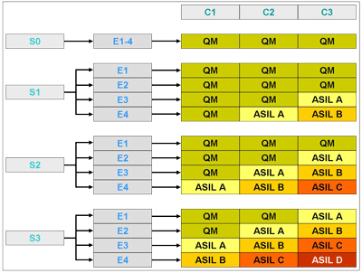

# Contents
[toc]
# ASIL in ISO 26262
From ISO 26262, ASIL (Automotive Safety Integrity Level) is used to classify the level of risk reduction required to ensure 
the safety of E/E systems in road vehicles, and helps determine the necessary safety measures to mitigate the potential 
hazards.
## ASIL Determination Matrix


### Legend

- **Severity (S)**
  - **S0**: No injuries
  - **S1**: Light and moderate injuries
  - **S2**: Severe and life-threatening injuries (survival probable)
  - **S3**: Life-threatening injuries (survival uncertain) or fatal injuries

- **Exposure (E)**
  - **E0**: Incredibly unlikely
  - **E1**: Very low probability
  - **E2**: Low probability
  - **E3**: Medium probability
  - **E4**: High probability

- **Controllability (C)**
  - **C0**: Controllable in general
  - **C1**: Simply controllable
  - **C2**: Normally controllable
  - **C3**: Difficult to control or uncontrollable

- **QM**: Quality Management (no specific safety requirements beyond normal quality processes)
- **ASIL A**: Basic safety measures
- **ASIL B**: Moderate safety measures
- **ASIL C**: Significant safety measures
- **ASIL D**: Most stringent safety measures
## ASIL Calculation from Metrics
Different reliability metrics impact ASIL differently, all outlined in ISO 26262.

Precisely mentioned: SPFM, LFM.

Assumed based on ISO 26262 decription: all other.
## ASIL Metrics Table

| Metric                                | ASIL A       | ASIL B        | ASIL C         | ASIL D       |
|-------------------------------        |--------------|---------------|----------------|--------------|
| **Single Point Fault Metric**         | NA           | > 90%         | > 97%          | > 99%        |
| **Latent Fault Metric**               | NA           | > 60%         | > 80%          | > 90%        |
| **Diagnostic Coverage**               | NA           | > 90%         | > 97%          | > 99%        |
| **Mean DurationValue To Failure (MTTF)**       | [1e3..1e4) h | [1e4..1e5) h  | [1e5..1e6) h   | [1e6..*) h   |
| **Mean DurationValue To Repair (MTTR)**        | [12..72) h   | [2..12) h     | [0.7..2) h     | [0.0..0.7) h |
| **Mean DurationValue Between Failures (MTBF)** | [1e3..1e4) h | [1e4..1e5) h  | [1e5..1e6) h   | [1e6..*) h   |
| **Availability**                      | NA           | > 99%         | > 99.5%        | > 99.9%      |
| **Reliability**                       | NA           | > 99%         | > 99.5%        | > 99.9%      |
| **Probability of Failure**            | [1..5) %     | [0.1..1) %    | [0.01..0.1) %  | [0..0.01) %  |
## Basis-Definition
```SysML::OpenBoardnet::Safety
abstract part def SafetyCriticalItem {
    attribute assignedASIL: DimensionOneValue {:>> range = 0..4;}
    attribute achievedFIT: DimensionOneValue {:>> range = 0..1000;}
    attribute safeStateDescription: String;
}
```
## ASIL Calculation (S, E, C)
```SysML::OpenBoardnet::Safety
calc def calcASIL {
    in attribute severity: DimensionOneValue {:>> range = 0..3;}
    in attribute exposure: DimensionOneValue {:>> range = 0..4;}
    in attribute controllability: DimensionOneValue {:>> range = 0..3;}
    
    attribute sum: DimensionOneValue = severity + exposure + controllability;
    // CORRECTION: Comparison with 0.0 
    attribute sumAdapted: DimensionOneValue = if controllability == 0.0  ? 0.0  else if severity == 0.0  ? 0.0  else sum;
    
    // CORRECTION: Calculation with 6.0  and 0.0 
    return result: DimensionOneValue = max(sumAdapted - 6.0 , 0.0 );   
}
```
## ASIL Dekomposition
```SysML::OpenBoardnet::Safety
calc def calculateASILDecomposition {
    in attribute part1: DimensionOneValue {:>> range = 0..4;}
    in attribute part2: DimensionOneValue {:>> range = 0..4;}
    in attribute isRedundant: Boolean;
    
    attribute redundantLevel: DimensionOneValue = min(part1 + part2, 4.0 );
    attribute notredundantLevel: DimensionOneValue = min(part1, part2);
    
    return result: DimensionOneValue = if isRedundant ? redundantLevel else notredundantLevel {:>> range = 0..4;} 
}
```
## ASIL aus Metriken (ISO 26262)
```SysML::OpenBoardnet::Safety
calc def ASIL_from_SPFM {
    in attribute SPFM_MPF: ISQ::DimensionOneValue  { :>> unit = "%";} 
    return level: ScalarValues::Integer = stepInterpolation(SPFM_MPF, 0.0, 1, 0.90, 2, 0.97, 3, 0.99, 4);
}
  
calc def ASIL_from_LFM {
    in attribute LFM: ISQ::DimensionOneValue  { :>> unit = "%";} 
    return level: ScalarValues::Integer = stepInterpolation(LFM, 0.0, 1, 0.60, 2, 0.80, 3, 0.90, 4);
}
        
calc def ASIL_from_DC {
    in attribute DC: ISQ::DimensionOneValue  { :>> unit = "%";} 
    return level: ScalarValues::Integer = stepInterpolation(DC, 0.0, 1, 0.90, 2, 0.97, 3, 0.99, 4);
}    
        
calc def ASIL_from_MTBF {
    in attribute MTBF: ISQ::DurationValue   { :>> unit = "h";} 
    return level: ScalarValues::Integer = stepInterpolation(MTBF, 0.0 [h], 0, 1e3 [h], 1, 1e4 [h], 2, 1e5 [h], 3, 1e6 [h], 4);
}
          
calc def ASIL_from_MTTR {
    in attribute MTTR: ISQ::DurationValue   { :>> unit = "h";} 
    return level: ScalarValues::Integer = stepInterpolation(MTTR, 0.0 [h], 4, 0.7 [h], 3, 2.0 [h], 2, 12.0 [h], 1, 72.0 [h], 0);
}
    
calc def ASIL_from_MTTF {
    in attribute MTTF: ISQ::DurationValue  { :>> unit = "h";} 
    return level: ScalarValues::Integer =  stepInterpolation(MTTF, 0.0 [h], 0, 1e3 [h], 1, 1e4 [h], 2, 1e5 [h], 3, 1e6 [h], 4);
}
      
calc def ASIL_from_Avail {
    in attribute Avail: ISQ::DimensionOneValue  { :>> unit = "%";} 
    return level: ScalarValues::Integer =  stepInterpolation(Avail, 0.0, 1, 0.99, 2, 0.995, 3, 0.999, 4);
} 
      
calc def ASIL_from_Reliab {
    in attribute Reliab: ISQ::DimensionOneValue { :>> unit = "%";} 
    return level: ScalarValues::Integer = stepInterpolation(Reliab, 0.0, 1, 0.99, 2, 0.995, 3, 0.999, 4);
}
    
calc def ASIL_from_ProbFail {
    in attribute ProbFail: ISQ::DimensionOneValue  { :>> unit = "%";} 
    return level: ScalarValues::Integer = stepInterpolation(ProbFail, 0.0, 4, 0.0001, 3, 0.001, 2, 0.01, 1, 0.05, 0);
}
```
## Anforderungen
```SysML::OpenBoardnet::Safety
requirement def SafetyGoal {
    subject s_item: SafetyCriticalItem; 
    
    attribute requiredASIL: DimensionOneValue {:>> range = 0..4;}
    attribute maxFIT: DimensionOneValue {:>> range = 0..1000;}
    
    constraint {s_item::assignedASIL == requiredASIL}
    constraint {s_item::achievedFIT <= maxFIT}
}
```
## ASIL Calculation Examples
```SysML::OpenBoardnet::Safety
attribute ASIL_calculated1: Integer = ASIL_from_SPFM    (98.3 [%]);    // input: SPFM             [0.0..100.0]              ==> [%]
attribute ASIL_calculated2: Integer = ASIL_from_LFM     (94.1 [%]);    // input: LFM              [0.0..100.0]              ==> [%]
attribute ASIL_calculated3: Integer = ASIL_from_DC      (97.1 [%]);    // input: DC               [0.0..100.0]              ==> [%]
attribute ASIL_calculated4: Integer = ASIL_from_MTTF    (24452.5 [h]); // input: MTTF             [thousands..millions]     ==> [h] 
attribute ASIL_calculated5: Integer = ASIL_from_MTTR    (2.2 [h]);     // input: MTTR             [minutes..hours](decimal) ==> [h]
attribute ASIL_calculated6: Integer = ASIL_from_MTBF    (24454.7 [h]); // input: MTTF             [thousands..millions]     ==> [h]
attribute ASIL_calculated7: Integer = ASIL_from_Avail   (99.6 [%]);    // input: Availability     [0.0..100.0]              ==> [%]
attribute ASIL_calculated8: Integer = ASIL_from_Reliab  (99.8 [%]);    // input: Reliability      [0.0..100.0]              ==> [%]
attribute ASIL_calculated9: Integer = ASIL_from_ProbFail(0.02 [%]);    // input: Prob. of Failure [0.0..100.0]              ==> [%]
attribute ASIL_obtained: Integer = min (ASIL_calculated1, ASIL_calculated2, ASIL_calculated3, ASIL_calculated4, ASIL_calculated5, ASIL_calculated6, ASIL_calculated7, ASIL_calculated8);
attribute ASIL_required: Integer = max (ASIL_calculated1, ASIL_calculated2, ASIL_calculated3, ASIL_calculated4, ASIL_calculated5, ASIL_calculated6, ASIL_calculated7, ASIL_calculated8);
```
