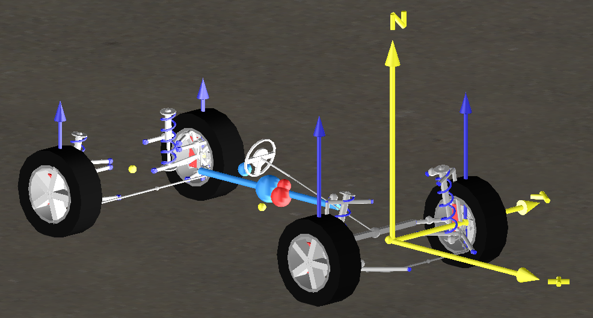
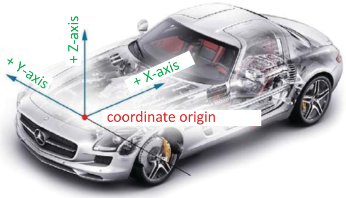

# Contents

[toc]

The package ```topology``` introduces two aspects: 
1) The 3-dimensional positioning of things inside a vehicle.
2) The installation spaces inside the vehicle with characteristic environmental loads.
# Topology
## Vehicle Origins and Coordinate Systems
The origins and coordinate systems must be established before you can start building a vehicle. It's always best to know which way is up because this is the seed from which the rest of the vehicle grows.

When a vehicle uses numerous coordinate systems for its components, additional issues may occur. Knowing how they relate to your vehicle's system is crucial; otherwise, you risk having engines that are facing the wrong way or transmissions that are facing the wrong way.
[[1]](https://www.claytex.com/tech-blog/vehicle-origins-and-coordinate-systems/)
### SAE coordinate system
The coordinate system, which is typically specified as "x, y, and z" in terms of the directions of the vehicle, 
is orientation in terms of x, y, and z relative to the vehicle, as in which axis goes in which direction.
Short: SAE uses the directions "Forwards, Rightwards, Downwards," 



[Figure 1: Vehicle Origin and Coordinate System, Source](https://www.claytex.com/wp-content/uploads/2021/09/VeSyMA-Origin.png)
### ISO coordinate system
In contrast to SAE, ISO, as demonstrated above, uses "Forwards, Leftwards, Upwards," and there are many more variations.



[Figure 2: Axis, Source](https://media.springernature.com/lw685/springer-static/image/chp%3A10.1007%2F978-3-658-33941-8_7/MediaObjects/291341_1_En_7_Fig3_HTML.png)


Furthermore, we introduce a vehicle origin and coordinate system in the vehicle.
This allows us to model the laying and to estimate wire lengths.

*(Note: The definition of specific Installation Spaces and their environmental loads can be found in the `LocationsAndSpaces` file.)*

To estimate the length of wires, we use the city block distance metric, 
multiplied with a constant factor.
```SysML::OpenBoardnet
package Topology {
    private import ISQ::*;
    private import ScalarValues::*;
    private import LocationsAndSpaces::*; 
    private import Network::*; 

    connection def PhysicalPath {
        end sourceLocation: Location;
        end targetLocation: Location;
        attribute pathLength: LengthValue = cityBlockDistance(sourceLocation::position,targetLocation::position) * 1.4;
    }

    part def VehicleTopology {
        part loc_center: LocationsAndSpaces::vehicleCenter;
        part loc_front_axle: LocationsAndSpaces::frontAxle;
        part loc_rear_axle: LocationsAndSpaces::rearAxle;
        part loc_fl_wheel: LocationsAndSpaces::wheelFrontLeft;
        part loc_fr_wheel: LocationsAndSpaces::wheelFrontRight;
        
        // Connections
        connection : PhysicalPath connect loc_center to loc_front_axle;
        connection : PhysicalPath connect loc_center to loc_rear_axle;
        connection : PhysicalPath connect loc_front_axle to loc_fl_wheel;
        connection : PhysicalPath connect loc_front_axle to loc_fr_wheel;
    }
}
```
